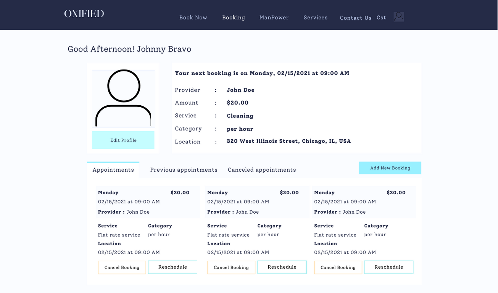

# Support Zebra Design Document

## Instructions


## *OXIFIED* Design

## 1. Problem Statement
  It is important for businesses and individuals to consider the potential impacts of a lack of  online presence in 
order to avoid these issues. Decrease visibility: Without internet presence, it can be difficult for potential customers
or clients to find and learn about your services. Limited reach: The internet provides a global platform for business to
reach customers, but if you are not online, you are missing out on this potential market. Lost opportunities: Without an 
internet presence, businesses may miss out on opportunities to connect with customers, share information, or sell 
products and services online.

  Performance review for manpower service providers should aim ot asses the provider's overall performance and identify
areas for improvement, as well as recognize any strengths or successes. However, with the lack of internet presence 
hinders the credibility of a service provider's work. Mostly, a customer can connect-with service providers that are
from known network.

  Indecisive Time Availability can be challenging for customers to get a work done, when a 
service provider is not available. This can be especially frustrating, as customers may not know when they 
can expect a service provider to be free.

## 2. Top Questions to Resolve in Review

*List the most important questions you have about your design, or things that
you are still debating internally that you might like help working through.*

1. Booking Payment
2. Booking Process(Startpoint to Endpoint)
3. Manage personnel for Service Provider (Company)

## 3. Use Cases

*This is where we work backwards from the customer and define what our customers
would like to do (and why). You may also include use cases for yourselves, or
for the organization providing the product to customers.*

U1. As user, I want to Signup, when I provide Email as Username and password

U2.	As User, I want to Login, When I provide Username and password

U3.	As User, I want to Create a Profile

U5.	As Customer, I want to Create a message SP

U6.	As Customer, I want to Create a review to a service

U7.	As Customer, I want to Create an Appointment

U8.	As Customer, I want to Update Appointment

U9.	As Customer, I want to View SP availability while booking

U10. As Customer, I want to view SP services

U11. As Customer, I want to view Service Cost and Reviews

U12. As Customer, I want to view service provider portfolio

U13. As Customer, I want to view Upcoming appointment, When I log in to dashboard

U14. As Customer, I want to view available services

U15. As Customer, I want to view Ongoing Appointment

U16. As Customer, I want to view upcoming Appointment

U17. As Customer, I want to view Appointment History

U21. As an SP, I want to create a service with provided serviceName, serviceTypeCost, category and serviceType.

U22. As SP, I want to Update a service

U23. As SP, I want to retrieve list of services

U24. As SP, I want to view reviews/service

U25. As SP, I want to view, Upcoming appointment, When I log in to dashboard

U26. As SP, I want to view booking Calendar

U27. As SP, I want to view Ongoing Appointment

U28. As SP, I want to view upcoming Appointment

U29. As SP, I want to view Appointment History

U32. As Admin, I want to create new SP

U33. As Admin, I want to retrieve list of SPs

U34. As Admin, I want to retrieve list of Customers

U35. As Admin, I want to delete SP

U36. As Admin, I want to delete Customer

U37. As Admin, I want to update SP

U38. As Admin, I want to view low reviews SP

U39. As Admin, I want to approve SP

U40. As Admin, I want to approve Reviews

U41. As Admin, I want to retrieve list of services

U42. As Admin, I want to view reviews per service

U43. As Admin, I want to view, Upcoming appointment per SP and Customer

U44. As Admin, I want to view booking Calendar per SP and Customer

U45. As Admin, I want to view Ongoing Appointment per SP and Customer

U46. As Admin, I want to view upcoming Appointment per SP and Customer

U47. As Admin, I want to view Appointment History per SP and Customer

U48. As Admin, I want to view Service cost per SP

## 4. Project Scope

*Clarify which parts of the problem you intend to solve. It helps reviewers know
what questions to ask to make sure you are solving for what you say and stops
discussions from getting sidetracked by aspects you do not intend to handle in
your design.*
- Online presence of skilled individual as service provider
- Rate and write review about service rendered by SP for other customer's reference.
- Service quotation for customer's budgeting reference.
- Availability of Service Provider
- appointment booking conflicts.
- separate means of communication.

### 4.1. In Scope

*Which parts of the problem defined in Sections 1 and 3 will you solve with this
design?*
- Creating, retrieving and updating user account
- Creating, retrieving and updating Service
- Creating, updating and canceling appointment
- Adding to and retrieve saved appointment to booking
- Creating, sending and retrieving Message
- - Creating, sending and retrieving Reviews

### 4.2. Out of Scope

*Based on your problem description in Sections 1 and 3, are there any aspects
you are not planning to solve? Do potential expansions or related problems occur
to you that you want to explicitly say you are not worrying about now? Feel free
to put anything here that you think your team can't accomplish in the unit, but
would love to do with more time.*
- Admin Page
- Billing
- Gift Cards and Referal bonus
- Service provider as Group/Company
- Ability to manage personnel

# 5. Proposed Architecture Overview

*Describe broadly how you are proposing to solve for the requirements you
described in Section 3.*

*This may include class diagram(s) showing what components you are planning to
build.*
#### [Admin Class Diagram](ClassDiagrams/oxifiedAdminUCD.puml)
#### [Customer Class Diagram](ClassDiagrams/oxifiedCustomerUCD.puml)
#### [Service Provider Class Diagram](ClassDiagrams/oxifiedServiceProviderUCD.puml)

*You should argue why this architecture (organization of components) is
reasonable. That is, why it represents a good data flow and a good separation of
concerns. Where applicable, argue why this architecture satisfies the stated
requirements.*

# 6. API

## 6.1. Public Models

### a. `AppointmentModel`
```
-   String appoinmentId
-	String time
-	String date
-	Service service
-	String address (appointmentLocation -> Address Class)
-	String status
```
### b. `ServiceModel`
```
-	String serviceId
-	String uaId
-	String description
-	BigDecimal serviceTypeCost
-	String category
-	String serviceType
-	String status
```
### c. `ReviewModel`
```
-	String reviewId
-	String serviceId
-	Double rating
-	String feedback
-	String status
```
###  d. `UserAccountModel`
```
-	String uaId (Hash)
-	Email
-	Password
-	String userType (Range)
-	String status
-	String lastName
-	String firstName
-	String contactNumber
-	String address
-	String birthdate
-	String gender
-	String image
-	Hashset<String> inbox
```
###  e. `AddressModel`
```
-	String address
-	String houseNumber
-	String lotNumber
-	String blockNumber
-	String street
-	String barangay
-	String City/Municipality
-	String Province
-	Int zipCode
```
###  f. `ProofModel`
```
-	String proofId
-	String id1
-	String id2
-	String proofOfBilling
```
###  g. `ServiceProviderModel`
```
-	String uaId
-	String serviceProvideId
-	String accountStatus – (inactive, active)
-	String backgroundChecked – (yes / no)
-	String experience
-	Language[] language
-	String [] businessHours (Monday – Sunday)  - 8am-5pm
-	LocalDateTime[] availability
-	String bookingId
```
###  h. `CustomerModel`
```
-	String uaId
-	String customerId
-	Address[] propertyLocation
-	String bookingId
```
###  i. `InboxModel`
```
-	String inboxId
-	String senderId
-	String receiverId
-	String messageToDisplay
```
###  j. `MessageModel`
```
-	String messageId
-	String inboxId
-	String senderId
-	String receiverId
-	String dateTimeSent
-	String messageBody
```
###  k.`BookingModel`
```
- String bookingId
- Appointment[] appointments
- Integer appointmentCount
```
## UserAccount Service
### 6.2 Create UserAccount EndPoint
* Accepts POST requests to /UserAccounts
* Accepts data to create a new user account with a provided uaId, userType, email, hashed password and an inactive status. Returns the new user account, including a unique user account ID (uaId) assigned by the user account service.
* We have a utility class with a validation method, and a method to generate a new, unique user account ID (uaId).
* For security concerns, we will validate that the provided user's email do not contain any invalid characters: ``` "'\ ```
* If the user's email contains any of the invalid characters, will throw an `InvalidAttributeValueException`.
* This API must create the user account with an empty list of inbox.
* 
* [Sequence Diagram Here!](SequenceDiagrams/CreateUserAccount.puml)

### 6.3 Get UserAccount EndPoint
* Accepts GET requests to /UserAccounts/:id
* Accepts a userAccount ID and returns the corresponding userAccountModel.
    * If the given user account ID (uaId) is not found, will throw a
      `UserAccountNotFoundException`
* 
  
### 6.4 Update UserAccount EndPoint
* Accepts PUT requests to /UserAccounts/:id
* Accepts data to update a user account including a uaId, userType, an updated password name, (optional) image, address, and contact number. Returns the updated user account.
* If the user account ID (uaId) is not found, will throw a `UserAccountNotFoundException`
*

## SPS Service
### 6.5 Create Service EndPoint
* Accepts POST requests to /Services
* Accepts data to create a new service with a provided serviceId, uaId, description, serviceTypeCost, category, serviceType, and status. Returns the new service, including a unique serviceId assigned by the SPS service.
* We have a utility class with a validation method, and a method to generate a new, unique user serviceId.
* For security concerns, we will validate that the provided serviceId and service name do not contain any invalid characters: ``` "'\ ```
* If the serviceId and service name contains any of the invalid characters, will throw an `InvalidAttributeValueException`.
* 
### 6.6 Get Service EndPoint
* Accepts GET requests to /Services
* Returns the list of ServiceModel.

### 6.7 Get ServicesByServiceProvider EndPoint
* Accepts GET requests to /UserAccounts/:id/Services/:id
* Accepts a serviceId and user account ID(uaId) and returns the corresponding list of ServiceModel.
    * If the given serviceId is not found, will throw a
      `ServiceNotFoundException`
* 
### 6.8 Update Service EndPoint
* Accepts PUT requests to /UserAccounts/:id/Services/:id
* Accepts data to update a service including a serviceId, uaId, updated: description, serviceTypeCost, category, serviceType, and status. Returns the updated service.
* If the serviceId is not found, will throw a `ServiceNotFoundException`
* 


## Appointment Service
### 6.9 Create Appointments EndPoint
* Accepts POST requests to /Appointment.
* Accepts data to create a new Appointment with a provided appointmentId, time, date, service, address, status.
  Returns the newly created appointment appointmentId assigned by Appointment Service.
* We have a utility class with a validation method, and a method to generate a unique Appointment ID.
* For security concerns, we will validate that the provided Appointment ID do not contain any invalid characters
  such as ``` "'\ ```.
* If the appointment ID contains any invalid characters, will throw an `InvalidAttributeValueException`.
* This API must create the Appointment with inactive status.
* [Sequence Diagram Here!](SequenceDiagrams/CreateAppointment.puml)
### 6.10 Add BookingAppointment EndPoint
* Accepts GET requests to /Booking/Appointment.
* Retrieves data from Appointment with the given Appointment ID. Returns appointment to save to an assigned 
  BookingId or creates new Booking ID assigned by ServiceProvider/Customer.
* We have a utility class with a validation method, and a method to generate a unique Booking ID.
* For security concerns, we will validate that the provided Booking ID do not contain any invalid characters
  such as ``` "'\ ```.
* If the Appointment ID contains any invalid characters, will throw an `InvalidAttributeValueException`.
* This API must create the Appointment with inactive status.
* [Sequence Diagram Here!](SequenceDiagrams/AddBookingAppointment.puml)
### 6.11 Update BookingAppointment EndPoint
* Accepts PUT requests to /Booking/Appointment.
* Retrieves data from Booking with the given Booking ID. Returns Booking to retrieve the Appointment 
  with the given Appointment ID by Customer. Returns appointment to update to the assigned Booking ID.
* We have a utility class with a validation method.
* For security concerns, we will validate that the provided Booking ID and Appointment ID do not contain any 
  invalid characters such as ``` "'\ ```.
* If the Appointment ID or Booking ID contains any invalid characters, will throw an `InvalidAttributeValueException`.
* [Sequence Diagram Here!](SequenceDiagrams/UpdateBookingAppointment.puml)
### 6.12 Get Booking EndPoint
* Accepts GET requests to /UserAccount.
* Retrieves Booking from each of the UserAccount. Returns each Booking with Appointments 
  to view by UserAccount.
* [Sequence Diagram Here!](SequenceDiagrams/GetBookingAppointment.puml)
### 6.13 Get BookingByCustomer EndPoint
* Accepts GET requests to /UserAccount.
* Retrieves Booking from each of the Customer. Returns each Booking with Appointments
  to view by Customer.
* [Sequence Diagram Here!](SequenceDiagrams/GetBookingByCustomerAppointment.puml)
### 6.14 Get BookingByServiceProvider EndPoint
* Accepts GET requests to /UserAccount.
* Retrieves Booking from each of the ServiceProvider. Returns each Booking with Appointments
  to view by ServiceProvider.
* [Sequence Diagram Here!](SequenceDiagrams/GetBookingByServiceProviderAppointment.puml)


## Review Service
### 6.15 Create Review EndPoint
* Accepts POST requests to /Reviews/
* Accepts data to create a new service review with a provided reviewId, serviceId, rating, feedback and status. Returns the new Service review, including the assigned unique review ID (reviewId).
* We have a utility class with a validation method, and a method to generate a new unique review ID (reviewId).
* For security concerns, we will validate that the provided review ID and feedback do not contain any invalid characters: ``` "'\ ```
* If the review ID and feedback contains any of the invalid characters, will throw an InvalidAttributeValueException.
* [Sequence Diagram Here!](SequenceDiagrams/CreateServiceReview.puml)

### 6.16 Get Review By Service EndPoint
* Accepts GET requests to /Reviews/:serviceId
* Accepts data to fetch reviews with a provided serviceId. Returns reviewId, serviceId, rating, feedback and status.
* We have a utility class with a validation method to validate serviceId ID (serviceId).
* For security concerns, we will validate that the provided service ID do not contain any invalid characters: ``` "'\ ```
* If the service ID contains any of the invalid characters, will throw an InvalidAttributeValueException.
* * [Sequence Diagram Here!](SequenceDiagrams/GetReviewsByService.puml)

### 6.17 Update Review EndPoint
* Accepts PUT requests to /Reviews/:reviewId
* Accepts data to Update reviews with a provided reviewId. Returns updated rating, feedback and status.
* We have a utility class with a validation method to validate review ID (reviewId).
* For security concerns, we will validate that the provided review ID do not contain any invalid characters: ``` "'\ ```
* If the review ID contains any of the invalid characters, will throw an InvalidAttributeValueException.
* [Sequence Diagram Here!](SequenceDiagrams/UpdateReviewByReviewId.puml)

## Message Service

### 6.18 Create Message EndPoint
* Accepts POST requests to /Messages
* Accepts data to create a new message provided messageId, inboxId, senderId, receiverId, messageBody, dateTimeSent. Returns the new message, including the assigned unique message ID (messageId).
* We have a utility class with a validation method, and a method to generate a new unique message ID (messageId).
* For security concerns, we will validate that the provided message ID and message body to do not contain any invalid characters: ``` "'\ ```
* If the message ID and message body contains any of the invalid characters, will throw an InvalidAttributeValueException.
* [Sequence Diagram Here!](SequenceDiagrams/CreateMessage.puml)

### 6.19 Get MessageByInboxId EndPoint
* Accepts GET requests to /Messages/:inboxId
* Accepts data to fetch messages provided inboxId. Returns messageId, senderId, receiverId, messageBody, dateTimeSent , including the assigned unique inbox ID (inboxId).
* We have a utility class with a validation method that validates inbox ID (inboxId).
* For security concerns, we will validate that the provided inbox ID and to do not contain any invalid characters: ``` "'\ ```
* If the inbox ID body contains any of the invalid characters, will throw an InvalidAttributeValueException.
* [Sequence Diagram Here!](SequenceDiagrams/GetMessagesByInboxId.puml)

### 6.20 Get InboxByUserAccount EndPoint
* Accepts GET requests to /Inbox/?senderId=uaId
* Accepts GET requests to /Inbox/?receiverId=uaId
* Accepts data to fetch inbox provided logged in uaId. Returns the inbox including the senderId, receiverId, messageBody, dateTimeSent.
* We have a utility class with a validation method that validates the user account ID (uaId).
* For security concerns, we will validate that the provided user account to do not contain any invalid characters: ``` "'\ ```
* If the user account ID contains any of the invalid characters, will throw an InvalidAttributeValueException.
* [Sequence Diagram Here!](SequenceDiagrams/GetInboxByUserAccount.puml)

# 7. Tables

*Define the DynamoDB tables you will need for the data your service will use. It
may be helpful to first think of what objects your service will need, then
translate that to a table structure, like with the *`Playlist` POJO* versus the
`playlists` table in the Unit 3 project.*
``` 
Useraccount and Service Table CLI Command:
 
aws cloudformation create-stack --region us-west-2 --stack-name supportzebrauseraccountservice-createtables --template-body file://main/cloudformation/dynamodbdesignandusage/useraccount_service_table.yaml --capabilities CAPABILITY_IAM
```

####  a. `UserAccount`
```
-	String uaId (Hash)
-	Email
-	Password
-	String userType (Range)
-	String status
-	String lastName
-	String firstName
-	String contactNumber
-	String address
-	String birthdate
-	String gender
-	String image
-	Hashset<String> inbox
-	String serviceProvideId
-	String accountStatus
-	String backgroundChecked
-	String experience
-	Language[] language
-	String [] businessHours
-	LocalDateTime[] availability
-	String customerId
-	Address[] propertyLocation
-	String id1
-	String id2
-	String proofOfBilling
-	String bookingId
```
#### b. `Service`
```
-	String serviceId (Hash)
-	String uaId
-	String description
-	BigDecimal serviceTypeCost
-	String category
-	String serviceType
-	String status
```
#### c. `Inbox`
```
-	String inboxId
-	String sender
-	String reciever
-	String message
-	localDateTIME messageSent 
```
#### d. `Messages`
```
-	String messageId
-	String inboxId
-	String sender
-	String reciever
-   String message
-	localDateTIME messageSent
```
#### e. `Reviews`
```
-	String reviewsId
-	String uaId
-	String serviceId 
-   String feedback
-   Integer rating
-	String status
```

#### f. `Booking`
```
-	String bookingId
-	Appointment[] appointments
-	Integer appointmentCount 
```

#### g. `Appointment`
```
-	String appointmentId
-	String date
-	String time 
-   Service service
-   String address
-	String status
```

# 8. Pages

*Include mock-ups of the web pages you expect to build. These can be as
sophisticated as mockups/wireframes using drawing software, or as simple as
hand-drawn pictures that represent the key customer-facing components of the
pages. It should be clear what the interactions will be on the page, especially
where customers enter and submit data. You may want to accompany the mockups
with some description of behaviors of the page (e.g. “When customer submits the
submit-dog-photo button, the customer is sent to the doggie detail page”)*





